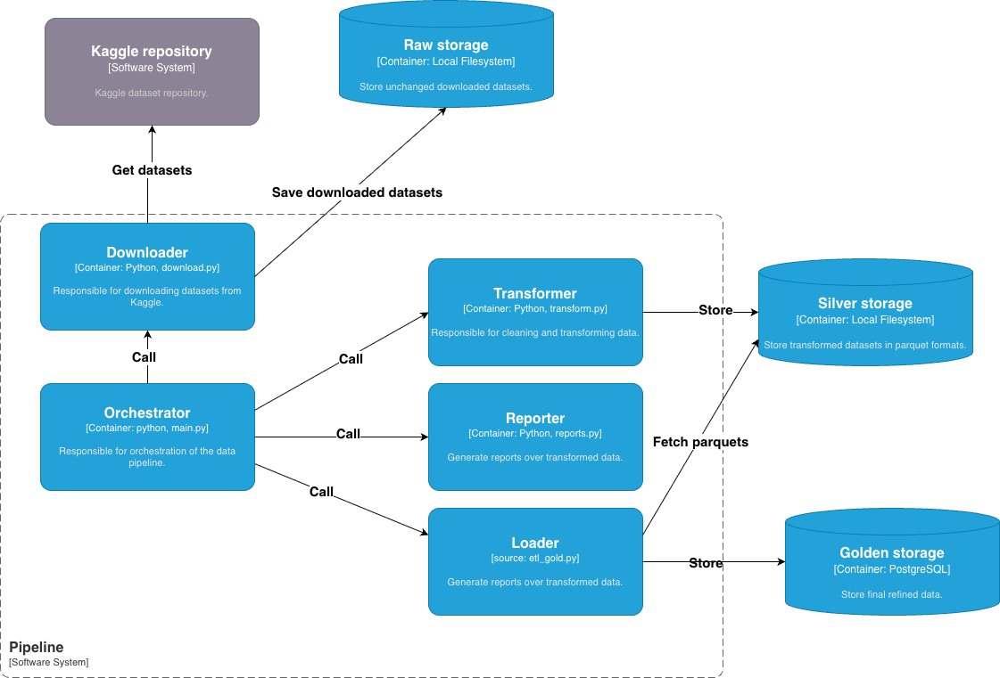
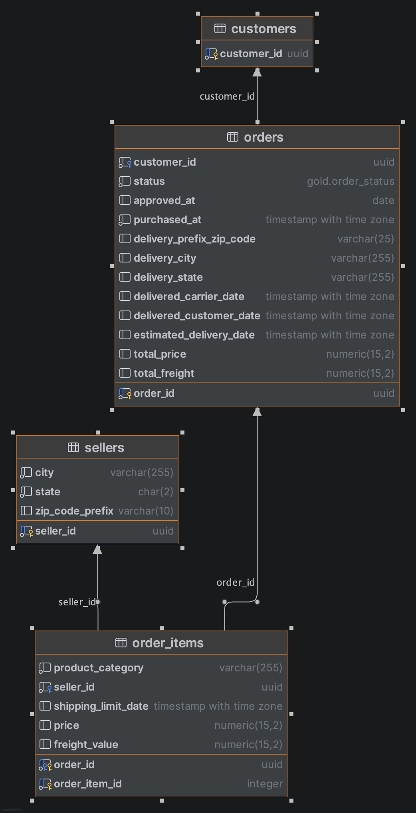

# 📦 Olist E-commerce Data Pipeline
Este projeto implementa um pipeline de dados ponta a ponta (ETL) para extrair, limpar e analisar os dados do marketplace Olist (maior plataforma de departamentos do Brasil). O pipeline segue a arquitetura de medalhão, processando dados da camada Raw (Bronze) para a Silver, e refinamento desses dados com tranformação para a camada Gold..

## 📍 Origem dos Dados
Os dados são extraídos do [Brazilian E-Commerce Public Dataset by Olist](https://www.kaggle.com/datasets/olistbr/brazilian-ecommerce) no Kaggle. O dataset contém informações reais de 100 mil pedidos de 2016 a 2018, com mais de 1 milhão de registros.

## 🚀 Como Rodar o Projeto
O projeto pode ser executado a partir do container Docker (recomendado) ou localmente, conforme instruções abaixo.

### Opção recomendada: Executar container

    $ docker-compose up --build

Em alguns casos rodando no MacOS, poderá ocorrer um erro de permissão ao tentar criar os diretórios de destino. Para executar sem erros, deve-se criar os diretórios manualmente, conforme abaixo:

    $ mkdir -p data/raw data/silver assets && chmod -R 777 data assets 

### Opção alternativa: Executar projeto localmente
### 1. Pré-requisitos
- Python 3.9 ou superior.
- Uma conta no Kaggle e um API Token (username e key).

### 2. Configuração do Ambiente
Clone o repositório e configure as dependências:

    # Criar ambiente virtual
    $ python -m venv venv
    $ source venv/bin/activate  # Linux/Mac
    $ venv\Scripts\activate     # Windows
    
    # Instalar dependências
    $ pip install -r requirements.txt

### 3. Variáveis de ambiente
Crie um arquivo .env na raiz do projeto com suas credenciais do Kaggle:

    KAGGLE_USERNAME=seu_usuario
    KAGGLE_KEY=seu_token_de_acesso

### 4. Execução
O projeto é orquestrado por um único ponto de entrada:

    $ python main.py

E pode ser executado com docker-compose:
    
    $ docker-compose up --build

## 🏗️ Arquitetura do Pipeline
1. Ingestão (Dowloader): Valida a autenticação e baixa os CSVs brutos para data/raw/. 
2. Transformação (Transformer):
   - Converte CSV para Parquet (colunar e otimizado).
   - Padroniza nomes para snake_case.
   - Trata valores ausentese tipagem de dados.
   - Gera metadados de integridade em data/silver/stats/. 
3. Relatório (Reporter): Gera visualizações automáticas e um documento Markdown com características dos dados.
4. Carregamento (Loader)
   - Carrega os parquets da camada silver;
   - Executa regras de negócio moldando dados para posterior armazenamento em DB;
   - Armazena os dados finais no DB.

## 📊 Dados Obtidos (Camada Silver)
Após rodar o pipeline, você terá acesso aos seguintes dados higienizados:

| Arquivo             | Descrição                                        |
|---------------------|--------------------------------------------------|
| orders.parquet      | Informações de status e datas de cada pedido.    |
| order_items.parquet | Itens, preços e valores de frete por pedido.     |
| payments.parquet    | Detalhes de pagamento (cartão, boleto, voucher). |
| customers.parquet   | Localização e identificação dos compradores.     |
| products.parquet    | Dimensões e categorias dos produtos vendidos.    |

### 📊 Relatórios Gerados

Contagem de Nulos: Validação de integridade por coluna.

Tipos de Dados: Garantia de que datas e números estão no formato correto.

Visualizações: Gráficos de sazonalidade, ticket médio e mix de pagamentos.

### 🛠️ Tecnologias Utilizadas
Linguagem: Python

Processamento: Pandas & PyArrow

Visualização: Seaborn & Matplotlib

Configuração: Python-Dotenv

Armazenamento: Apache Parquet, PostgreSQL

### Descritivo: camada gold

