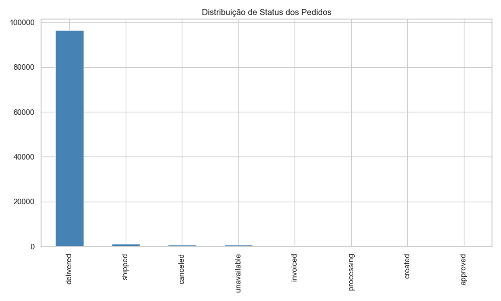
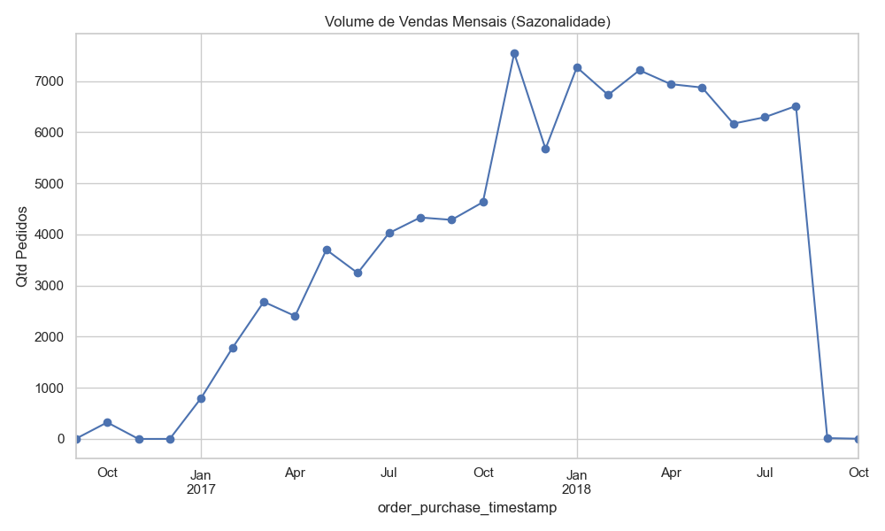
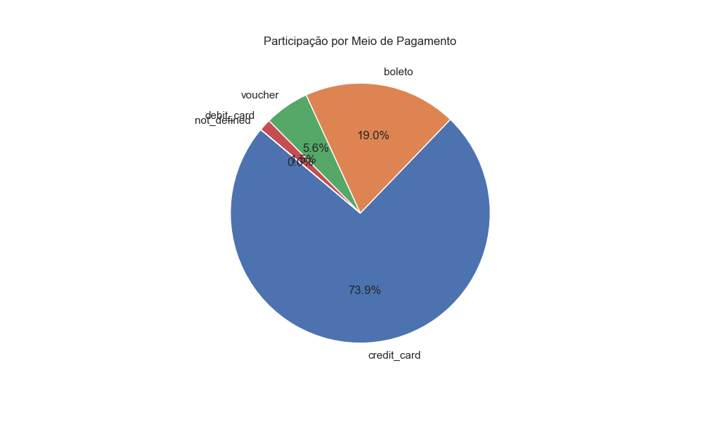
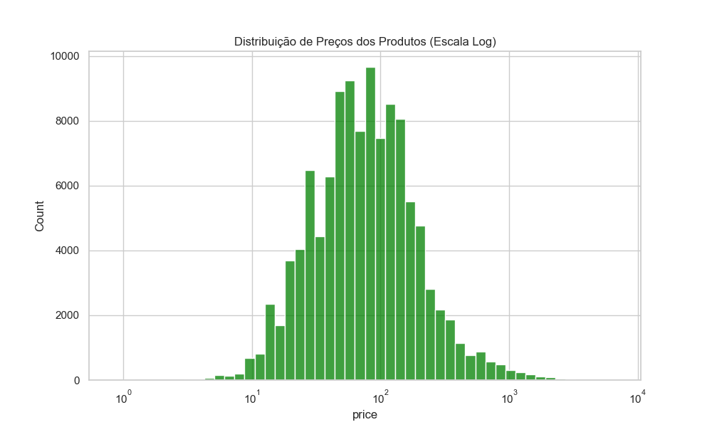
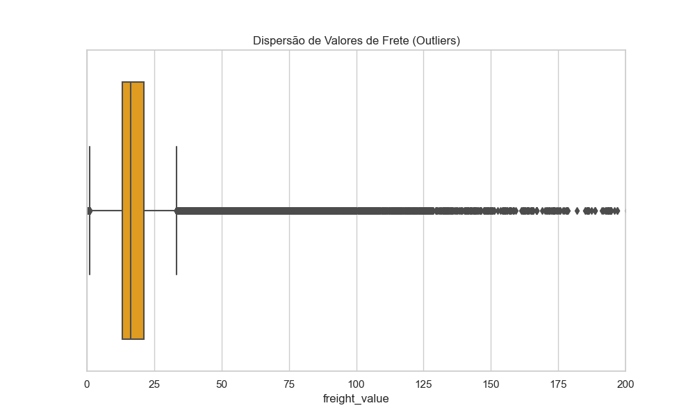

# 📑 Relatório de Governança e Qualidade - Camada Silver

Este documento detalha a integridade técnica e os insights iniciais do dataset Olist.

## 🛠️ 1. Dicionário de Dados e Integridade
Abaixo, a análise de tipos e preenchimento para cada tabela processada:

### 📋 Tabela: `category_translation`
- **Total de Linhas:** 71
| Coluna | Tipo | Nulos | % Integridade |
| :--- | :--- | :--- | :--- |
| `product_category_name` | object | 0 | 100.0% |
| `product_category_name_english` | object | 0 | 100.0% |

---
### 📋 Tabela: `customers`
- **Total de Linhas:** 99,441
| Coluna | Tipo | Nulos | % Integridade |
| :--- | :--- | :--- | :--- |
| `customer_id` | object | 0 | 100.0% |
| `customer_unique_id` | object | 0 | 100.0% |
| `customer_zip_code_prefix` | int64 | 0 | 100.0% |
| `customer_city` | object | 0 | 100.0% |
| `customer_state` | object | 0 | 100.0% |

---
### 📋 Tabela: `geolocation`
- **Total de Linhas:** 738,332
| Coluna | Tipo | Nulos | % Integridade |
| :--- | :--- | :--- | :--- |
| `geolocation_zip_code_prefix` | int64 | 0 | 100.0% |
| `geolocation_lat` | float64 | 0 | 100.0% |
| `geolocation_lng` | float64 | 0 | 100.0% |
| `geolocation_city` | object | 0 | 100.0% |
| `geolocation_state` | object | 0 | 100.0% |

---
### 📋 Tabela: `order_items`
- **Total de Linhas:** 112,650
| Coluna | Tipo | Nulos | % Integridade |
| :--- | :--- | :--- | :--- |
| `order_id` | object | 0 | 100.0% |
| `order_item_id` | int64 | 0 | 100.0% |
| `product_id` | object | 0 | 100.0% |
| `seller_id` | object | 0 | 100.0% |
| `shipping_limit_date` | datetime64[ns] | 0 | 100.0% |
| `price` | float64 | 0 | 100.0% |
| `freight_value` | float64 | 0 | 100.0% |

---
### 📋 Tabela: `order_payments`
- **Total de Linhas:** 103,886
| Coluna | Tipo | Nulos | % Integridade |
| :--- | :--- | :--- | :--- |
| `order_id` | object | 0 | 100.0% |
| `payment_sequential` | int64 | 0 | 100.0% |
| `payment_type` | object | 0 | 100.0% |
| `payment_installments` | int64 | 0 | 100.0% |
| `payment_value` | float64 | 0 | 100.0% |

---
### 📋 Tabela: `order_reviews`
- **Total de Linhas:** 99,224
| Coluna | Tipo | Nulos | % Integridade |
| :--- | :--- | :--- | :--- |
| `review_id` | object | 0 | 100.0% |
| `order_id` | object | 0 | 100.0% |
| `review_score` | int64 | 0 | 100.0% |
| `review_comment_title` | object | 0 | 100.0% |
| `review_comment_message` | object | 0 | 100.0% |
| `review_creation_date` | datetime64[ns] | 0 | 100.0% |
| `review_answer_timestamp` | datetime64[ns] | 0 | 100.0% |

---
### 📋 Tabela: `orders`
- **Total de Linhas:** 99,441
| Coluna | Tipo | Nulos | % Integridade |
| :--- | :--- | :--- | :--- |
| `order_id` | object | 0 | 100.0% |
| `customer_id` | object | 0 | 100.0% |
| `order_status` | object | 0 | 100.0% |
| `order_purchase_timestamp` | datetime64[ns] | 0 | 100.0% |
| `order_approved_at` | object | 0 | 100.0% |
| `order_delivered_carrier_date` | datetime64[ns] | 1,783 | 98.2% |
| `order_delivered_customer_date` | datetime64[ns] | 2,965 | 97.0% |
| `order_estimated_delivery_date` | datetime64[ns] | 0 | 100.0% |

---
### 📋 Tabela: `products`
- **Total de Linhas:** 32,951
| Coluna | Tipo | Nulos | % Integridade |
| :--- | :--- | :--- | :--- |
| `product_id` | object | 0 | 100.0% |
| `product_category_name` | object | 0 | 100.0% |
| `product_name_lenght` | float64 | 610 | 98.1% |
| `product_description_lenght` | float64 | 610 | 98.1% |
| `product_photos_qty` | float64 | 610 | 98.1% |
| `product_weight_g` | float64 | 2 | 100.0% |
| `product_length_cm` | float64 | 2 | 100.0% |
| `product_height_cm` | float64 | 2 | 100.0% |
| `product_width_cm` | float64 | 2 | 100.0% |

---
### 📋 Tabela: `sellers`
- **Total de Linhas:** 3,095
| Coluna | Tipo | Nulos | % Integridade |
| :--- | :--- | :--- | :--- |
| `seller_id` | object | 0 | 100.0% |
| `seller_zip_code_prefix` | int64 | 0 | 100.0% |
| `seller_city` | object | 0 | 100.0% |
| `seller_state` | object | 0 | 100.0% |

---

## 📈 2. Visualizações de Negócio (Exploração Silver)

### Status dos Pedidos

### Sazonalidade Mensal

### Meios de Pagamento

### Distribuição de Preços

### Análise de Frete

